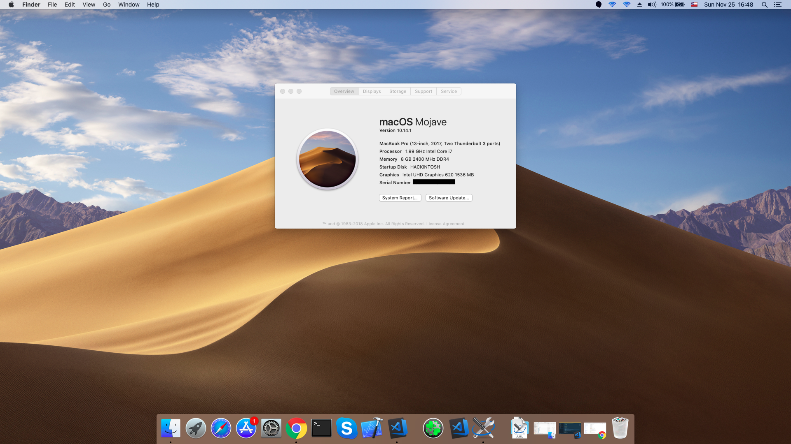
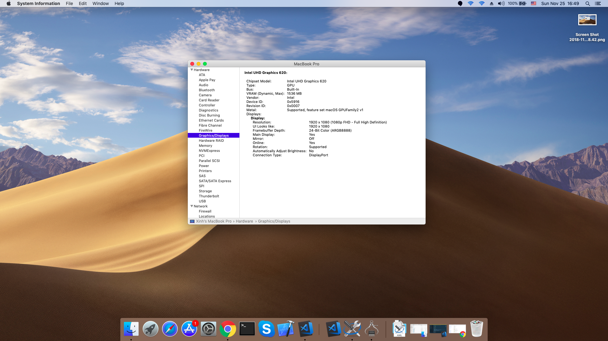
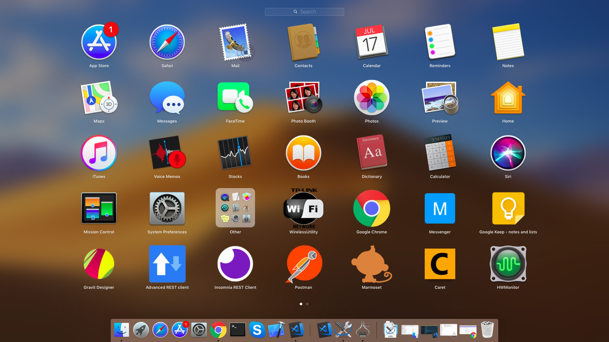

# Hackintosh for ASUS VivoBook X510UQR (ASUS VivoBook S15 S510UQ-BQ483T)

- [Guide](Guide.md)
- [Patch](Patch.md)
- [Other](Other.md)

---

# macOS VERSION
- 10.13.6 High Sierra
- 10.14.x Mojave

# SPECIFICATIONS

- **MainBoard:** ASUS X510UQR
- **Processor:** i7-8550U (Kaby Lake R) (4 cores, 8 threads, 8MB cache)
- **Graphic:** 
  + UHD 620 (1536MB of dynamic memory (shared from the system))
  + NVIDIA GeForce 940MX , with 2GB GDDR5 VRAM
- **Network:**
  + Wifi: Intel 8265/8275 M2 NGFF (802.11 AC (2x2))
  + Ethernet: No
  + Bluetooth: V4.1
- **Audio:** Conexant Generic (Vendor ID: 0x14f11f72, 0x14f1 0x1f72, Conexant CX8050)
- **Touchpad:** ELAN 1300 (I2C)
- **BIOS:** v301/302
- Memory: SK Hynix 8GB DDR4 2400 MHz (up to 16 GB SDRAM) (2 slots)
- Display: 15.6" (16:9) FHD (1920x1080) 60Hz Anti-Glare Panel 45% NTSC with 178˚ wide-viewing angle display
- Storage:
  + Hard Drives: 1TB 5400RPM SATA HDD
  + Solid State Drives: 128GB SATA3 M.2 SSD
- Keyboard: Chiclet keyboard
- Card Reader: SD/SDHC
- WebCam: VGA Web Camera
- Battery: 3 Cells 42 Whrs Battery

_Recommed replace card wifi with DW1560 (Broadcom BCM4352, M2, NGFF)_

# WORKING:
- [x] **Graphics UHD 620** (https://www.quora.com/How-many-GB-does-Intel-HD-Graphics-620-have)
- [x] Graphics GT 940MX (NO support now)
- [x] **Sound**
- [x] **WiFi** (Replace with USB Wifi or Card wifi)
- [x] Bluetooth (Replace with USB Wifi or Card wifi)
- [x] Apple Store
- [x] External USB headphone
- [x] USB 2.0
- [x] USB 3.0
- [x] Adjust brightness
- [x] Fn feature
- [x] Led light keyboard
- [x] Sleep power
- [x] Battery
- [x] Trackpad
- [x] Full 4 cores
- [x] Temporature (HWMonitor)
- [x] Disabling discrete graphics GPU (https://www.tonymacx86.com/threads/guide-disabling-discrete-graphics-in-dual-gpu-laptops.163772/)
- ~~[ ] Ethernet (This laptop not support)~~
- [ ] Hardware Acceleration (Not test yet)
- [ ] Personal Hotspot (Not test yet)
- [ ] Power Management and P-States (Not test yet)
- [ ] iCloud (Not test yet)
- [ ] iMessage (Not test yet)
- [ ] Airdrop (Not test yet)
- [ ] AirPlay (Not test yet)
- [ ] iBooks (Not test yet)
- [ ] HandOff (Not test yet)

# KNOWN ISSUES
- Fn + F9 to Disabled trackpad not working

# WIFI SOLUTION
- USB Wifi:
  + [USB Wifi TP-Link Archer T2U v2 (AC600, MT7650)](https://www.tp-link.com/en/products/details/cat-11_Archer-T2U.html) and [Kexts](https://github.com/chris1111/TP-LINK-WIFI-Network-macOS)
- USB Ethernet Adapter:

# SPECIAL THANKS
- [tctien342](https://github.com/tctien342/) [EFI](https://github.com/tctien342/Asus-Vivobook-S510UA-High-Sierra-10.13-Hackintosh)
- [hieplpvip](https://github.com/hieplpvip/) [VoodooI2C](https://github.com/hieplpvip/VoodooI2C)
- [chris1111](https://github.com/chris1111/) [TP-LINK WIFI Network](https://github.com/chris1111/TP-LINK-WIFI-Network-macOS)
- [RehabMan](https://github.com/RehabMan/)
- https://www.tonymacx86.com/
- https://www.insanelymac.com/

# REFERENCES
- https://www.asus.com/us/Laptops/ASUS-VivoBook-S15-S510UQ/specifications/
- https://www.asus.com/us/Laptops/ASUS-VivoBook-S15-S510UA/specifications/
- https://github.com/tctien342/Asus-Vivobook-S510UA-High-Sierra-10.13-Hackintosh/
- https://www.tonymacx86.com/threads/guide-new-voodooi2c-asus-vivobook-s15-x510uar-10-13.245445/
- https://hackintosher.com/guides/dual-boot-macos-drive-windows-10-already-installed-shared-drive/
- https://hackintosher.com/guides/hackintosh-dual-boot-windows-10-and-macos-high-sierra/
- https://www.insanelymac.com/forum/topic/330677-successguide-glasgoods-high-sierra-coffeelake-asus-strix-z370-g-i7-8700-gtx1080ti-uhd/
- https://github.com/RehabMan/OS-X-Clover-Laptop-Config/
- https://github.com/chris1111/Wireless-USB-Adapter-Clover
- and more...

# SCREENSHOTS

